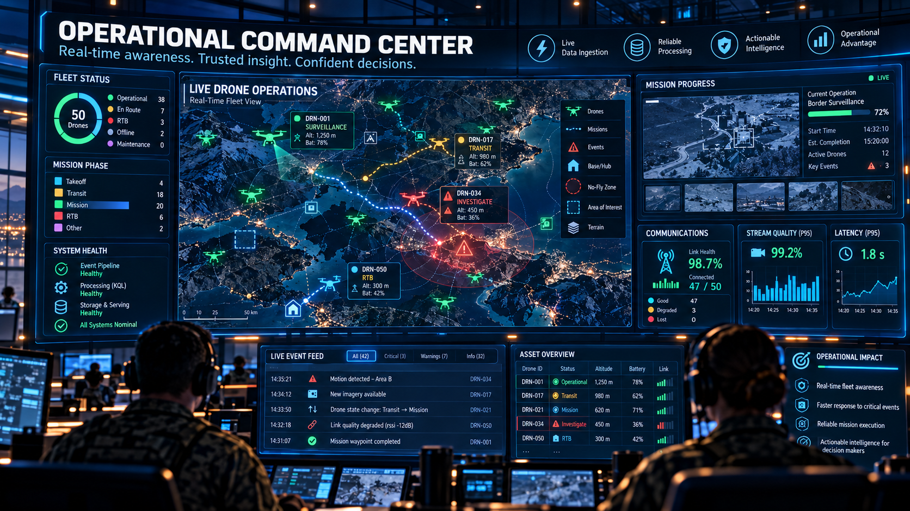
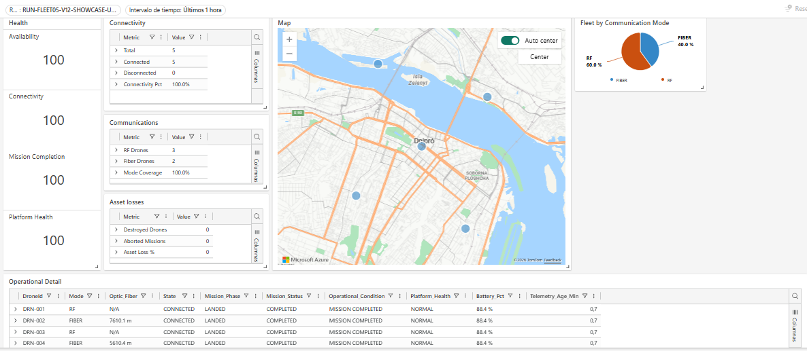

<p align="center">
  
</p>

<h1 align="center">Azure Real-Time Analytics Pipeline</h1>

<p align="center">
  Transforming imperfect event delivery into trustworthy operational data.
</p>

<p align="center">
  <a href="docs/architecture_and_scope.md">Architecture</a> |
  <a href="docs/README.md">Documentation</a> |
  <a href="docs/evidence_index.md">Evidence</a> |
  <a href="contracts/README.md">Contracts</a> |
  <a href="dashboards/rtd-drone-operations.json">Dashboard</a>
</p>

---

## The problem

Real-time systems rarely receive perfectly ordered, perfectly timed, duplicate-free events.

A streaming platform must be able to answer questions such as:

- Did Azure receive every logical event?
- Did the same event arrive more than once?
- Is the stream complete but late?
- Can current operational state still be reconstructed after telemetry becomes stale or stops?
- Can downstream consumers trust the state they are seeing?

The challenge is not simply to ingest events.

The challenge is to make **imperfect event delivery observable, explainable, and analytically trustworthy**.

---

## The idea

Real-time data is only useful when both its **state** and its **delivery quality** can be trusted.

This project transforms a controlled synthetic event stream into:

- reliable analytical event layers
- measurable stream integrity and timeliness
- reconstructed operational state
- reusable Gold serving interfaces
- evidence-backed operational observability

The drone domain is a **synthetic producer and failure-injection environment**.

The main engineering focus is the Azure streaming and KQL analytical architecture.

---

## Architecture

```text
Synthetic Event Producer
        ↓
Azure Event Hubs
        ↓
RawDroneEvents
        ↓
KQL Transformations
        ↓
Parsed Analytical Tables
        ↓
Canonical Event Layer
        ↓
Stream Quality / Timeliness / State Reconstruction
        ↓
Gold Serving Functions
        ↓
Real-Time Dashboard
```

The architecture deliberately separates **physical delivery** from **logical event identity**.

A duplicate physical delivery can remain visible in Raw while downstream consumers still receive a single canonical logical event.

### Visual technical guides

- [Stream Reliability & Timeliness](diagrams/02_stream_reliability.png)
- [State Reconstruction](diagrams/03_state_reconstruction.png)
- [Failure → Operational Observability](diagrams/04_failure_to_observability.png)
- [Operational Command Center](diagrams/05_operational_command_center.png)

---

## What this pipeline solves

This project focuses on **real streaming reliability problems**, not only event ingestion.

It provides solutions for:

- ⚡ **Real-Time Ingestion**  
  Publish synthetic telemetry through Azure Event Hubs while preserving transport metadata and source identity.

- 🧱 **Raw / Parsed / Canonical Processing**  
  Separate physical ingestion evidence from typed analytical structures and canonical logical events.

- 🔍 **Stream Reliability**  
  Detect duplicate delivery, missing sequences, gaps, out-of-order behavior, delayed arrival, bursts, and reconciliation differences.

- 🧠 **State Reconstruction**  
  Rebuild current operational state from multiple canonical event families instead of trusting only the latest telemetry row.

- 📊 **Operational Observability**  
  Expose fleet state, communication health, stream quality, reconciliation, and per-asset timelines through a real-time dashboard.

---

## Technical Scope

The project operates on:

- Azure Event Hubs ingestion
- KQL transformation functions
- update policies
- materialized views
- canonical event modeling
- stream integrity analytics
- stream timeliness analytics
- Raw-to-Canonical reconciliation
- multi-source state reconstruction
- Gold serving functions
- RF / FIBER communication semantics
- controlled failure scenarios
- operational dashboard consumption
- versioned Event Contract v1.2
- public-safe evidence and dashboard export

The analytical implementation is versioned under:

```text
kql/
```

and organized as scripts `01` through `10`.

---

## Reliability model

The project treats **integrity** and **timeliness** as separate dimensions.

```text
Integrity ≠ Timeliness
```

A stream may be logically complete and still arrive late.

Likewise:

```text
Physical delivery count
        may differ from
Logical event count
```

without corrupting downstream state.

Representative controlled conditions include:

- duplicate delivery
- missing / dropped events
- buffered reconnect
- out-of-order arrival
- RF degradation
- FIBER link loss
- mixed RF / FIBER fleets
- terminal asset behavior

The intended chain is:

```text
Injected condition
        ↓
Observable Azure / KQL effect
        ↓
Analytical detection
        ↓
Operational interpretation
```

---

## State reconstruction

The project distinguishes between:

```text
latest observation
        ≠
latest operational state
```

Telemetry, state transitions, and status confirmations can contribute different evidence.

Evidence precedence and event semantics are used to reconstruct the current state while preserving the latest telemetry observation independently.

This allows disconnects, terminal states, and other operational changes to remain visible even after telemetry becomes stale or stops.

---

## Gold serving

Reusable KQL functions provide stable analytical interfaces for downstream consumers.

Principal serving surfaces include:

```text
CurrentFleetOperationalView()
CurrentFleetOperationalSummary()
CurrentFleetMapView()
```

The dashboard consumes these analytical outputs instead of duplicating business logic inside visualizations.

---

## Operational Dashboard

The pipeline is designed to turn reliable analytical processing into usable real-time operational awareness.

<p align="center">
  
</p>

> **Conceptual illustration:** this image communicates the operational value of the pipeline.  
> The screenshots below are the actual implementation evidence.

The versioned dashboard contains four analytical pages:

- **Operations**
- **Stream Quality**
- **Drone Detail**
- **Communications**

<p align="center">
  
</p>

The dashboard exposes both **operational state** and **data-system health**.

Additional dashboard evidence:

- [Stream Quality](evidence/06_dashboard/02_stream_quality_dashboard.png)
- [Drone Detail](evidence/06_dashboard/03_asset_detail_dashboard.png)
- [Communications](evidence/06_dashboard/04_communications_dashboard.png)

The public dashboard export is available at:

```text
dashboards/rtd-drone-operations.json
```

Environment-specific Fabric/Kusto datasource identifiers are sanitized in the public artifact while visual definitions, parameters, and KQL are preserved.

---

## Evidence

The repository includes **33 reviewed public-safe screenshots** organized by capability:

```text
evidence/
├── 01_event_hubs_ingestion/
├── 02_kql_processing/
├── 03_stream_quality/
├── 04_state_and_serving/
├── 05_failure_scenarios/
└── 06_dashboard/
```

Selected proof:

| Capability | Evidence |
|---|---|
| Event Hubs ingestion | [Transport metadata](evidence/01_event_hubs_ingestion/03_event_hubs_metadata.png) |
| Canonicalization | [Canonical deduplication](evidence/02_kql_processing/05_canonical_deduplication.png) |
| Stream reliability | [Raw ↔ Canonical reconciliation](evidence/03_stream_quality/09_raw_canonical_reconciliation.png) |
| State reconstruction | [Current reconstructed state](evidence/04_state_and_serving/02_current_state_reconstruction.png) |
| Failure isolation | [Mixed-fleet failure isolation](evidence/05_failure_scenarios/06_failure_isolation_mixed_fleet.png) |
| Operational observability | [Operations dashboard](evidence/06_dashboard/01_operations_dashboard.png) |

Full evidence navigation:

- [Evidence Checklist](docs/evidence_checklist.md)
- [Evidence Index](docs/evidence_index.md)

---

## Repository Structure

| Section | Description |
|---|---|
| [Architecture](docs/architecture_and_scope.md) | Project mission, scope, architecture, and design principles |
| [Documentation](docs/README.md) | Technical documentation hub and reading paths |
| [KQL](kql/) | Raw, Parsed, Canonical, quality, state, serving, and migration logic |
| [Contracts](contracts/README.md) | Versioned producer / consumer event contracts |
| [Dashboard](dashboards/) | Sanitized versioned dashboard export |
| [Diagrams](diagrams/) | Conceptual visual documentation for architecture, reliability, state, failures, and operational value |
| [Evidence](docs/evidence_index.md) | Claim-to-evidence navigation |
| [Simulator](docs/simulator_and_event_model.md) | Synthetic producer and failure-injection model |
| [Tests](tests/) | Supporting validation assets |

---

## Documentation

Recommended reading path:

1. [Architecture and Scope](docs/architecture_and_scope.md)
2. [Streaming and KQL Architecture](docs/streaming_and_kql_architecture.md)
3. [Stream Quality and Timeliness](docs/stream_quality_and_timeliness.md)
4. [State Reconstruction and Serving](docs/state_reconstruction_and_serving.md)
5. [Communications and Failure Scenarios](docs/communications_and_failure_scenarios.md)
6. [Dashboard and Observability](docs/dashboard_and_observability.md)
7. [Evidence Index](docs/evidence_index.md)

Additional project-boundary documentation:

- [Known Limitations](docs/known_limitations.md)
- [Future Improvements](docs/future_improvements.md)
- [Portfolio Positioning](docs/portfolio_positioning.md)

---

## Design Principles

- Preserve physical ingestion evidence
- Protect logical event identity
- Separate integrity from timeliness
- Reconstruct state from explicit evidence
- Keep serving logic reusable
- Keep dashboards thin
- Make failure behavior observable
- Prefer evidence-backed technical claims
- Keep the synthetic domain secondary to the Data Engineering architecture

---

## Project Boundaries

This is a portfolio-scale Azure Data Engineering MVP.

It does **not** claim:

- production SLA guarantees
- enterprise-scale throughput
- multi-region disaster recovery
- full enterprise security hardening
- enterprise retention architecture
- production workload certification

The synthetic source exists so event-delivery conditions can be controlled, repeated, and explained.

See [Known Limitations](docs/known_limitations.md) for the complete boundary discussion.

---

## Philosophy

Real-time systems should not depend on:

- assuming delivery is perfect
- equating arrival order with event truth
- treating the latest row as the complete operational state
- hiding stream-quality problems inside the presentation layer

Operational data should be:

- observable
- explainable
- reconcilable
- state-aware
- evidence-backed

---

## Summary

This project demonstrates an Azure real-time analytics pipeline capable of ingesting, normalizing, reconciling, validating, reconstructing, serving, and observing imperfect event streams.

Azure Event Hubs transports the stream, KQL transforms and validates it, Gold functions expose reusable analytical outputs, and the dashboard makes operational state and stream health visible together.

---

## Author

Me 🙃
