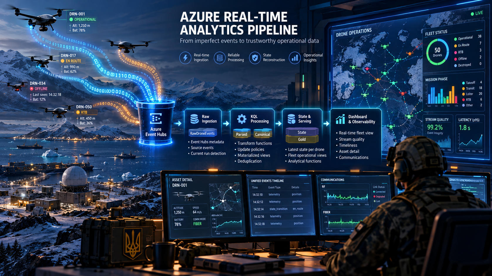

<p align="center">
  <a href="README.md">← Back</a> |
  <a href="../README.md">Home</a> |
  <a href="README.md">Documentation</a> |
  <a href="evidence_index.md">Evidence</a> |
  <a href="implementation_plan.md">Next →</a>
</p>

---

# Architecture and Scope

**Project:** `azure-real-time-analytics-pipeline`
**Project type:** Public Azure Data Engineering portfolio project
**Status:** Implemented / final documentation and repository closeout
**Primary focus:** Real-time ingestion, KQL analytical engineering, stream reliability, state reconstruction, serving, and observability

---

## 1. Project Mission

Build a real-time Azure Data Engineering pipeline that can ingest imperfect event streams and transform them into trustworthy analytical and operational outputs.

The project is designed to demonstrate that real-time data engineering requires more than moving events quickly.

The pipeline must also be able to answer:

```text
What physically arrived?

What does each event mean?

Did the expected logical stream arrive correctly?

Did it arrive on time?

What is the latest trustworthy operational state?

What should downstream consumers use?
```

The synthetic drone domain provides a controlled source of events and failure conditions.

The primary project is the Azure analytical architecture built around those events.

---

## 2. Professional Question

```text
Can I design a real-time Azure data platform that preserves delivery evidence,
normalizes events, protects logical identity, measures integrity and timeliness,
reconstructs operational state, and exposes reusable analytical outputs?
```

---

## 3. End-to-End Architecture

<p align="center">
  
</p>

```text
Synthetic Event Producer
        ↓
Azure Event Hubs
        ↓
RawDroneEvents
        ↓
KQL Transformations
        ↓
Parsed Event Tables
        ↓
Canonical Event Views
        ↓
┌─────────────────────────────────────┐
│ Stream Integrity                    │
│ Stream Timeliness                   │
│ Raw ↔ Canonical Reconciliation      │
│ State Reconstruction                │
└─────────────────────────────────────┘
        ↓
Gold Serving Functions
        ↓
Real-Time Dashboard
```

The architecture preserves multiple views of the same stream because each layer answers a different engineering question.

---

## 4. Architectural Responsibilities

### Raw ingestion

The Raw layer preserves what the cloud ingestion path physically received.

It retains producer fields together with Event Hubs transport metadata such as:

```text
event_id
event_type
source_sequence_number
event_time
eh_enqueued_time
eh_sequence_number
eh_offset
```

### Parsed analytical layers

KQL transformation functions convert nested event payloads into typed analytical tables.

Implemented event families include:

```text
TelemetryParsed
StateTransitionsParsed
MaintenanceEventsParsed
StatusConfirmationsParsed
```

### Canonical analytical layer

Canonical views protect logical event identity.

The key principle is:

```text
Physical delivery count
        may differ from
Logical event count
```

A duplicated physical delivery remains visible in Raw while Canonical represents one logical event per `event_id`.

### Reliability analytics

The project treats stream integrity and stream timeliness as separate concerns.

Integrity evaluates concepts such as:

```text
duplicates
missing sequences
sequence gaps
out-of-order behavior
Raw ↔ Canonical reconciliation
```

Timeliness evaluates concepts such as:

```text
relative delay
physical arrival gaps
cloud latency
buffered delivery
bursts
```

### State reconstruction

Current state is derived from canonical event evidence rather than only from the latest telemetry row.

The model separates:

```text
latest observation
        ≠
latest operational state
```

Telemetry, explicit state transitions, status confirmations, and limited controlled inference can contribute evidence with deterministic precedence.

### Gold serving

Reusable KQL functions expose stable analytical contracts for downstream consumers.

Principal examples include:

```text
CurrentFleetOperationalView()
CurrentFleetOperationalSummary()
CurrentFleetMapView()
```

### Dashboard and observability

The dashboard consumes analytical outputs rather than becoming the source of business or reliability truth.

Its final public structure contains four pages:

```text
Operations
Communications
Stream Quality
Drone Detail
```

---

## 5. Communication and Failure Model

Event Contract v1.2 introduces explicit source-level communication context.

Supported communication modes include:

```text
RF
FIBER
```

A fleet may contain both modes simultaneously.

The project uses controlled scenarios such as:

```text
duplicate delivery
drop / missing event
extra delay
buffered reconnect
out-of-order arrival
RF link degradation
FIBER link loss
terminal asset behavior
```

These scenarios exist to exercise the Data Engineering architecture under imperfect delivery conditions.

The simulator is therefore a test harness for reliability and state behavior rather than the primary product.

---

## 6. Contract Evolution

Producer and consumer behavior is governed through versioned event contracts.

Current evolution:

```text
v1.0
  ↓
v1.1
  ↓
v1.2
```

Contract changes propagate through:

```text
Producer
   ↓
Event Hubs
   ↓
Raw
   ↓
Transform
   ↓
Parsed
   ↓
Canonical
   ↓
Serving
   ↓
Dashboard
```

Current contract documentation:

- [Event Contract v1.2](../contracts/event_contract_v1_2.md)
- [Contracts Overview](../contracts/README.md)

---

## 7. MVP Scope

The implemented MVP includes:

- Synthetic multi-asset event generation
- Azure Event Hubs publishing
- Raw cloud ingestion
- Event Hubs metadata preservation
- KQL parsing into typed event-family tables
- Canonical logical-event views
- Sequence-based integrity analysis
- Duplicate, missing, gap, and out-of-order detection
- Stream timeliness and latency analysis
- Raw-to-Canonical reconciliation
- Multi-source state reconstruction
- Latest observation modeling
- Gold operational serving functions
- RF / FIBER communication context
- Controlled communication and transport failures
- Four-page real-time dashboard
- Source-controlled sanitized dashboard export
- Versioned Event Contract v1.2
- Public-safe technical evidence
- Repository and closeout documentation

---

## 8. Out of Scope

The MVP intentionally does not claim:

- Production SLA guarantees
- Enterprise-scale throughput certification
- Multi-region disaster recovery
- Full enterprise network isolation
- Complete enterprise security hardening
- Long-term production retention architecture
- Automated infrastructure deployment for every component
- Production-grade telecommunications or drone-physics simulation
- A real-world military command-and-control implementation

The synthetic domain exists so delivery conditions can be controlled, repeated, and validated.

See [Known Limitations](known_limitations.md) for the complete boundary discussion.

---

## 9. KQL Implementation Boundary

The analytical implementation is versioned under:

```text
kql/
```

The main sequence is:

```text
01_create_tables.kql
02_transform_functions.kql
03_update_policies.kql
04_materialized_views.kql
05_quality_functions.kql
06_state_functions.kql
07_serving_functions.kql
08_performance_functions.kql
09_contract_v1_1_migration.kql
10_contract_v1_2_migration.kql
```

The numbering reflects logical dependency and implementation evolution.

---

## 10. Evidence Strategy

The project is evidence-backed rather than claim-only.

The final public evidence set contains **33 reviewed screenshots** across:

```text
01_event_hubs_ingestion
02_kql_processing
03_stream_quality
04_state_and_serving
05_failure_scenarios
06_dashboard
```

Evidence is intentionally separated from conceptual illustrations.

```text
evidence/   = execution proof
diagrams/   = conceptual communication
```

See:

- [Evidence Checklist](evidence_checklist.md)
- [Evidence Index](evidence_index.md)

---

## 11. Design Principles

### Preserve physical evidence

Raw ingestion should retain enough information to explain how the stream physically arrived.

### Protect logical identity

Duplicate physical delivery should not become duplicate logical events downstream.

### Separate integrity from timeliness

Completeness does not imply freshness, and freshness does not imply completeness.

### Use event semantics for state

Arrival order alone is insufficient for reconstructing operational truth.

### Keep observation separate from state

The latest measured position and the latest known operational state may originate from different events.

### Expose reusable serving interfaces

Dashboard consumers should use analytical functions instead of rebuilding state logic independently.

### Make failures observable

Controlled failure conditions should produce measurable and explainable downstream signals.

### Keep the synthetic source secondary

The simulator creates test conditions; Azure Event Hubs, KQL, reliability analytics, state reconstruction, serving, and observability are the main Data Engineering story.

---

## 12. Success Criteria

The MVP is successful when the repository can demonstrate that:

1. Events are published through Azure Event Hubs.
2. Raw ingestion preserves source and transport evidence.
3. KQL transforms events into typed analytical structures.
4. Canonicalization protects logical identity.
5. Duplicate, missing, delayed, and reordered behavior is observable.
6. Raw and Canonical logical event counts reconcile.
7. Current operational state can be reconstructed from multiple event families.
8. Gold serving functions expose reusable analytical outputs.
9. RF / FIBER context propagates through the analytical stack.
10. Controlled failures create explainable downstream signals.
11. The dashboard exposes both operational state and data-system health.
12. Public evidence supports the principal technical claims.

---

## 13. Repository Role

This project is intended to demonstrate a specific portfolio capability:

```text
Azure real-time analytical engineering
+
stream reliability
+
state reconstruction
+
operational observability
```

The strongest professional story is not:

```text
I built a drone simulator.
```

It is:

```text
I built a real-time Azure Data Engineering pipeline that can explain
what arrived, whether it can be trusted, what state it represents,
and how that state should be served to operational consumers.
```

---

<p align="center">
  <a href="README.md">← Back</a> |
  <a href="../README.md">Home</a> |
  <a href="README.md">Documentation</a> |
  <a href="evidence_index.md">Evidence</a> |
  <a href="implementation_plan.md">Next →</a>
</p>
