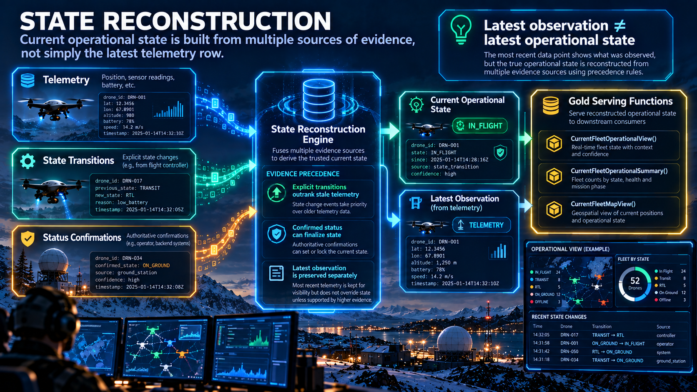

<p align="center">
  <a href="stream_quality_and_timeliness.md">← Back</a> |
  <a href="../README.md">Home</a> |
  <a href="README.md">Documentation</a> |
  <a href="evidence_index.md">Evidence</a> |
  <a href="communications_and_failure_scenarios.md">Next →</a>
</p>

---

# State Reconstruction and Serving


**Project:** `azure-real-time-analytics-pipeline`
**Focus:** Event-driven state reconstruction and reusable Gold serving interfaces

---

## 1. Purpose

A real-time stream contains events.

Operational consumers usually need **state**.

Those are not the same thing.

For example, receiving the latest physical row does not automatically answer:

```text
What is the current connection state?

What is the current mission state?

What is the latest trustworthy location?

When was that state established?

Did the latest telemetry observation occur before or after the latest state transition?
```

The project therefore separates:

```text
EVENT HISTORY
      ↓
STATE EVIDENCE
      ↓
CURRENT STATE
      +
LATEST OBSERVATION
      ↓
GOLD SERVING
```

---

## 2. Why Latest Ingestion Is Not Enough

Real-time delivery may include:

* Late events
* Buffered events
* Out-of-order arrival
* Different event families
* Explicit state transitions
* Status confirmations
* Telemetry snapshots

Therefore:

```text
last row ingested
```

does not necessarily equal:

```text
latest operational truth
```

State reconstruction must reason about event semantics and event time.

---

## 3. State Evidence Model

The main state-normalization function is:

```text
StateEvidence(p_RunId)
```

It combines canonical information from multiple event families into a common evidence model.

Primary sources include:

```text
StatusConfirmationsCanonical
StateTransitionsCanonical
TelemetryCanonical
```

The resulting normalized evidence includes concepts such as:

```text
drone_id
state_domain
state_value
event_time
source_sequence_number
evidence_type
evidence_rank
evidence_event_id
reason_code
bronze_ingested_at
```

This allows different event families to participate in the same state-resolution process.

---

## 4. State Domains

Operational state is reconstructed independently by domain.

Current domains include concepts such as:

```text
asset_state
connection_state
mission_phase
mission_status
platform_health
```

This is important because different domains may be updated by different events.

Conceptually:

```text
Asset
 │
 ├── asset_state
 ├── connection_state
 ├── mission_phase
 ├── mission_status
 └── platform_health
```

The system does not require one telemetry event to be authoritative for every state dimension.

---

## 5. Evidence Priority

Not all evidence has the same semantic strength.

The current state model uses explicit ranking.

Conceptually:

```text
Status Confirmation
        300
         ↓
State Transition
        200
         ↓
Telemetry
        100
         ↓
Controlled Inference
         10
```

The exact purpose is not to declare one event family universally "better."

The ranking provides a deterministic tie-breaking rule when multiple pieces of evidence describe the same state domain at the same effective event time.

---

## 6. Why Explicit Events Matter

Consider two pieces of evidence:

```text
Telemetry:
connection_state = CONNECTED
```

followed by:

```text
State Transition:
CONNECTED → DISCONNECTED
```

If telemetry stops after the transition, selecting only the latest telemetry row could incorrectly continue displaying:

```text
CONNECTED
```

The explicit state-transition event provides newer semantic evidence.

This is why state reconstruction operates across canonical event families rather than only against telemetry.

---

## 7. Latest State Evidence

The next layer is:

```text
LatestStateEvidence(p_RunId)
```

Evidence is evaluated independently for each:

```text
drone_id + state_domain
```

The implemented ordering considers:

```text
event_time DESC
evidence_rank DESC
source_sequence_number DESC
```

Conceptually:

```text
Which evidence happened latest?
        ↓
If tied:
Which evidence is semantically stronger?
        ↓
If still tied:
Which source sequence is newer?
```

The result is one selected piece of evidence per state domain and asset.

---

## 8. Event Time Over Arrival Time

This ordering is deliberate.

The system does not primarily use:

```text
bronze_ingested_at
```

to determine state truth.

Instead it favors:

```text
event_time
```

because ingestion timing may have been affected by:

* Buffering
* Reconnection
* Network latency
* Delayed transport

This allows an event that arrived later to still be placed correctly in the logical state history.

---

## 9. Controlled Inference

The current model contains limited inference for cases where domain semantics establish an implied state.

For example, a transition into:

```text
mission_phase = LANDED
```

may provide fallback evidence for:

```text
mission_status = COMPLETED
asset_state = AVAILABLE
```

This inference has deliberately lower priority than explicit telemetry, transitions, or confirmations.

Conceptually:

```text
Explicit evidence available?
        ↓ YES
Use explicit evidence

        ↓ NO

Controlled domain inference
```

Inference therefore acts as a fallback, not as the primary state source.

---

## 10. Fleet Current State

The function:

```text
FleetCurrentState(p_RunId)
```

takes the selected state evidence and produces an operational state representation per asset.

The output contains state dimensions such as:

```text
asset_state
connection_state
mission_phase
mission_status
platform_health
state_as_of
```

Conceptually:

```text
LatestStateEvidence
        ↓
one row per state domain
        ↓
FleetCurrentState
        ↓
one operational state per asset
```

This creates a reusable state layer independent from dashboard visuals.

---

## 11. Latest Telemetry Observation

State alone is not enough.

Operational consumers also need the latest physical observation.

The project therefore maintains:

```text
LatestTelemetryObservation(p_RunId)
```

which selects the most recent canonical telemetry observation per asset using logical event ordering.

The observation includes fields such as:

```text
latitude
longitude
altitude_m

ground_speed_mps
vertical_speed_mps
heading_deg

battery_pct

communication_mode
optic_fiber_remaining_m

telemetry_as_of
telemetry_ingested_at
```

The important distinction is:

```text
State
≠
Observation
```

---

## 12. Example: State vs Observation

Consider this sequence:

```text
10:00:01
Telemetry
Position = A
Connection = CONNECTED

10:00:02
State Transition
CONNECTED → DISCONNECTED

10:00:03
No telemetry received
```

The correct analytical interpretation is:

```text
Latest known position = A

Current connection state = DISCONNECTED
```

The platform should not invent a new position.

It should also not retain `CONNECTED` merely because the latest telemetry row said so.

---

## 13. Gold Operational View

The main serving function is:

```text
FleetOperationalView(p_RunId)
```

It combines:

```text
FleetCurrentState(p_RunId)
        +
LatestTelemetryObservation(p_RunId)
```

using the shared asset identity.

Conceptually:

```text
Reconstructed State
        │
        ├──────────────┐
        │              │
        ↓              ↓
Current State     Latest Observation
        │              │
        └──────┬───────┘
               ↓
      FleetOperationalView
```

This produces a dashboard-ready analytical record without requiring dashboard queries to reproduce state logic.

---

## 14. Operational Serving Output

The serving view exposes a combination of:

### Identity

```text
simulator_run_id
drone_id
battalion_id
mission_id
```

### State

```text
asset_state
connection_state
mission_phase
mission_status
platform_health
```

### Observation

```text
latitude
longitude
altitude_m
heading_deg
ground_speed_mps
vertical_speed_mps
battery_pct
communication_mode
optic_fiber_remaining_m
```

### Temporal Context

```text
telemetry_as_of
state_as_of
telemetry_ingested_at
telemetry_state_gap_ms
```

This provides a clear analytical contract for downstream consumers.

---

## 15. Telemetry-State Gap

The serving model also exposes:

```text
telemetry_state_gap_ms
```

This measures the temporal difference between:

```text
latest state evidence
```

and:

```text
latest telemetry observation
```

That distinction matters because a single serving row may intentionally combine information from different source events.

For example:

```text
Position last observed:
10:00:01

Connection state established:
10:00:04
```

The row is analytically valid, but the fields do not all originate from one event.

The temporal metadata makes this explicit.

---

## 16. Fleet Operational Summary

The function:

```text
FleetOperationalSummary(p_RunId)
```

aggregates the Gold operational view into fleet-level KPIs.

Current metrics include concepts such as:

```text
TotalDrones

AvailableDrones
ConnectedDrones
CompletedMissions
HealthyDrones

RfDrones
FiberDrones
UnknownCommunicationModeDrones

AvgBatteryPct
MinBatteryPct

AvgOpticFiberRemainingM
MinOpticFiberRemainingM
```

and derived percentages such as:

```text
AvailabilityPct
ConnectivityPct
MissionCompletionPct
HealthyPct
CommunicationModeCoveragePct
```

The dashboard therefore consumes standardized business-facing metrics instead of recomputing them independently.

---

## 17. Current-Run Serving

Parameterized functions remain available for explicit historical analysis:

```text
FleetOperationalView(RunId)
FleetOperationalSummary(RunId)
```

For operational dashboard usage, convenience wrappers select the latest observed execution:

```text
CurrentFleetOperationalView()
CurrentFleetOperationalSummary()
CurrentFleetMapView()
```

These depend on:

```text
LatestObservedRun()
```

Conceptually:

```text
RawDroneEvents
        ↓
LatestObservedRun()
        ↓
RunId
        ↓
Gold serving functions
        ↓
Dashboard
```

This removes hard-coded Run IDs from normal dashboard operation.

---

## 18. Map Serving

`CurrentFleetMapView()` provides a focused interface for geospatial and operational visualization.

It exposes information such as:

```text
location
movement
battery

communication_mode
optic_fiber_remaining_m

asset_state
connection_state
mission_phase
mission_status
platform_health

telemetry_age_sec
```

This keeps map queries lightweight while preserving the state-reconstruction semantics established upstream.

---

## 19. Why Serving Functions Matter

Without a serving layer, each dashboard tile could independently implement:

```text
latest telemetry logic
+
state reconstruction
+
joins
+
Run ID selection
+
KPI calculations
```

That would create several risks:

```text
Duplicated logic
Different definitions between visuals
Harder maintenance
Harder testing
Harder schema evolution
```

Instead:

```text
KQL analytical logic
        ↓
Stable Gold function
        ↓
Multiple dashboard visuals
```

This creates a reusable semantic boundary between Data Engineering and presentation.

---

## 20. Terminal-State Behavior

State reconstruction becomes particularly valuable when an asset stops producing telemetry.

For example:

```text
Latest known observation
        ↓
Position A

Later state evidence
        ↓
DESTROYED
```

No new telemetry may follow.

A telemetry-only analytical model might eventually make the asset appear stale or absent.

The state-oriented model can preserve:

```text
Last known observation
        +
Current terminal state
```

This demonstrates why operational truth cannot always be reduced to:

```text
arg_max(latest telemetry)
```

alone.

---

## 21. Serving Architecture

<p align="center">
  
</p>

> **Conceptual guide:** shows how canonical event evidence is normalized, ranked, resolved into current state, kept separate from the latest telemetry observation, and exposed through Gold serving functions.


The logical Gold flow is:

```text
Canonical Event Families
          │
          ↓
     StateEvidence
          │
          ↓
 LatestStateEvidence
          │
          ↓
  FleetCurrentState
          │
          ├───────────────────┐
          │                   │
          │        LatestTelemetryObservation
          │                   │
          └──────────┬────────┘
                     ↓
           FleetOperationalView
                     │
             ┌───────┼────────┐
             ↓       ↓        ↓
          Summary   Map    Dashboard
```


---

## 22. Design Principles

### State is derived from event semantics

Physical ingestion order is not treated as operational truth.

### State domains are resolved independently

One event does not need to define every aspect of current state.

### Explicit evidence outranks inference

Inference remains a low-priority fallback.

### Observation and state remain separate concepts

The latest measured position and latest known operational state may come from different events.

### Gold functions define reusable analytical interfaces

Presentation logic should consume them rather than reconstructing state independently.

### Temporal context remains visible

Consumers can determine when telemetry and state were last established.

---

## 23. Engineering Value

This layer demonstrates an important real-time Data Engineering principle:

```text
Streaming events are historical facts.

Operational state is a derived analytical product.
```

The architecture transforms canonical event history into current operational state while preserving:

```text
event semantics
temporal ordering
evidence priority
latest observation
state timestamps
```

and exposes the result through reusable Gold serving functions.

This provides a stronger analytical foundation than simply querying the most recently ingested telemetry record.

---

<p align="center">
  <a href="stream_quality_and_timeliness.md">← Back</a> |
  <a href="../README.md">Home</a> |
  <a href="README.md">Documentation</a> |
  <a href="evidence_index.md">Evidence</a> |
  <a href="communications_and_failure_scenarios.md">Next →</a>
</p>
